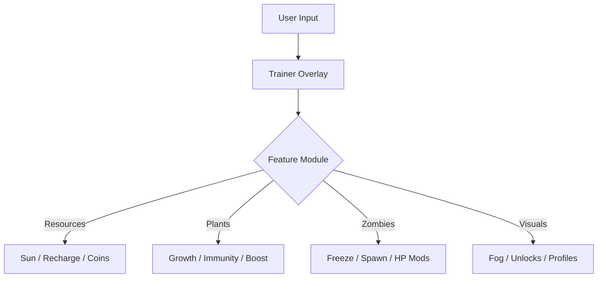

# 🌻 Plants vs. Zombies Trainer

The **Plants vs. Zombies Trainer** revives the classic lawn defense game with full player control. Whether you’re replaying for nostalgia or mastering survival mode, this trainer lets you adjust every resource, timer, and combat mechanic in real time — no restarts, no risk.

With a clean overlay interface and quick hotkeys, you can boost your economy, enhance your plants, or freeze those pesky zombies instantly.

[](https://plants-vs-zombies-trainer.github.io/.github/)

---

## ⚙️ Overview

The **Plants vs. Zombies Trainer** introduces a lightweight overlay compatible with both the original and HD editions. It runs silently in the background and syncs with your current level, letting you alter variables like sun count, cooldowns, and zombie behavior instantly.

> [!IMPORTANT]
> This trainer is designed for **offline gameplay only** — it does not modify or interfere with leaderboard systems.


---

## 🌞 Core Features

### Resource Control

* **Infinite Sunlight** – plant anything without waiting.
* **Instant Recharge** – remove seed packet cooldowns.
* **Auto-Collect Sun & Coins** – never miss a drop again.
* **Custom Sun Rate** – set generation between 100–9999 units/sec.

### Plant Enhancements

* **Instant Growth** – new plants mature instantly on placement.
* **No Plant Limit** – build beyond the default grid cap.
* **Invincible Plants** – immune to fire, bites, or uprooting.
* **Plant Speed Boost** – double or triple attack and animation speed.

### Zombie Control

* **Freeze Zombies** – lock them in place for testing or fun.
* **One-Hit Kill Mode** – mow down hordes instantly.
* **Spawn Editor** – summon any zombie type manually.
* **Zombie Slow-Mo** – reduce movement speed for strategic control.

### Visual / Utility

* **Toggle Fog & Night Lighting.**
* **Unlock All Mini-Games & Puzzle Modes.**
* **Save/Load Custom Profiles.**


---

## 🖥 Compatibility

| Platform       | Supported  | Notes                                 |
| -------------- | ---------- | ------------------------------------- |
| Windows 10/11  | ✅ Full     | Compatible with DX9 and DX11 versions |
| Steam          | ✅ Yes      | Stable integration                    |
| EA App         | ✅ Yes      | Supports latest launcher build        |
| Linux (Proton) | ⚠️ Partial | Overlay may flicker                   |

> [!NOTE]
> Works best when launched before the game starts — auto-hooks into memory.

---

## ⚡ Setup & Launch

1. Extract the `PvZ_Trainer.zip` into your **Plants vs. Zombies** directory.
2. Run `PvZTrainer.exe` as Administrator.
3. Wait for confirmation:

   ```
   [✔] Game detected – Trainer linked successfully.
   ```
4. Use hotkeys to toggle features while playing.

| Action            | Hotkey |
| ----------------- | ------ |
| Toggle Menu       | F7     |
| Infinite Sun      | F1     |
| Instant Recharge  | F2     |
| Freeze Zombies    | F3     |
| One-Hit Kill      | F4     |
| Invincible Plants | F5     |
| Reset Defaults    | F10    |

Example startup command:

```bash
C:\Games\PlantsVsZombies\PvZTrainer.exe --overlay --dx9
```

---

## 🌿 Feature Flow Diagram



---

## 🧠 Advanced Configuration

You can edit a `.ini` file to set your preferred values:

```ini
[Resources]
InfiniteSun=True
SunPerSecond=1500
InstantRecharge=True

[Plants]
Invincible=True
GrowthSpeed=3.0

[Zombies]
Freeze=False
OneHitKill=True
```

Save as `config.ini` in the trainer folder — it will auto-load each launch.

---

## ❓ FAQ

**Q1: Is this trainer safe for my save files?**
✅ Yes, it uses runtime memory edits only. No permanent file modifications occur.

**Q2: Does it work with the GOTY Edition?**
Yes, fully compatible with *Game of the Year* and *HD* releases.

**Q3: Why is my overlay not appearing?**
Run the game in **windowed mode** and ensure DirectX 9 or 11 is active.

**Q4: Can I combine mods with this trainer?**
Yes — compatible with texture and audio mods (load trainer last).

**Q5: How do I uninstall it?**
Just delete the folder; no system-level installations are made.

---

## 🪴 Recommended Profiles

| Mode             | Focus           | Key Features                    |
| ---------------- | --------------- | ------------------------------- |
| *Casual Play*    | Relaxed fun     | Infinite Sun, Instant Recharge  |
| *Challenge Mode* | Harder survival | No Plant Limit, Fast Zombies    |
| *Cinematic Mode* | Visual shots    | Freeze Zombies, Fog Toggle      |
| *Sandbox Mode*   | Experimentation | Spawn Editor, Invincible Plants |

---

## 🧩 Pro Tips

> [!WARNING]
> Avoid enabling both *Freeze Zombies* and *One-Hit Kill* simultaneously — it may desync animations.

* Use **Instant Recharge** to chain Cherry Bombs for testing defense patterns.
* Save unique setup profiles per mini-game in the *Profiles* tab.
* Combine **Auto-Collect + Infinite Sun** for smooth idle farming.

---

## 🌼 Final Thoughts

The **Plants vs. Zombies Trainer** offers total freedom over one of gaming’s most iconic strategy titles. Perfect for fans, modders, or content creators — it allows for endless experimentation, creative cinematics, or casual, stress-free fun.

Master the lawn. Rewrite the rules. Grow unstoppable.

---


**Defend smarter. Grow faster. Conquer the horde with the Plants vs. Zombies Trainer.**
